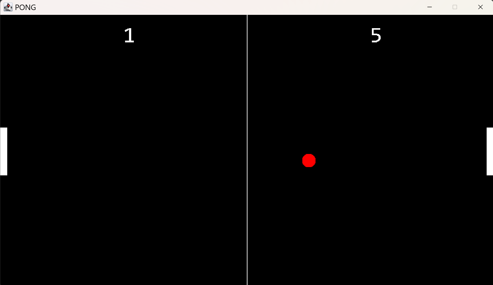

<h1 align="center">🏓 Pong — Java Edition</h1>

  A two-player Pong game built as a Java GUI project — featuring a main menu, local multiplayer, and first to 10 points wins.

  
  
  

 

### 🎮 Features

- 🏠 Main menu with controls guide
- 👥 Local two-player multiplayer
- 🏆 First to 10 points wins
- ⌨️ Player 1 — W / S keys
- ⌨️ Player 2 — ↑ / ↓ arrow keys

 

### 🚀 How to Run

1. Make sure **Java** is installed on your computer
2. Download or clone this repository
3. Open the project in **Eclipse IDE**
4. Run the main file

 

### 🛠️ Built With

- Java
- Java Swing
- Eclipse IDE

 

### 📸 Screenshots

  
    
  

